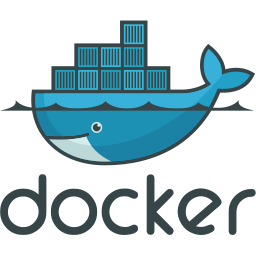

# Linguagem-Java
## Sumário abaixo:
**É apresentado todo conteúdo de Java desenvolvido durante a aula**
>Nesse repositório visa demonstrar e mostrar os códigos aprendido em sala de aula sobre a linguagem Java e o framework SpringBoot

# Sumário:
## Conteúdo 
+ Ferramentas
    + [**Docker**](https://www.docker.com/products/docker-desktop/)
    + [**Eclipse**](https://www.eclipse.org/downloads/)
    + [**Postman**](https://www.postman.com/downloads/)
    + [**Spring Tool**](https://spring.io/tools)

+ Escrevendo o primeiro código

---

## • Docker
> Docker é uma plataforma de software que permite criar, gerenciar e executar aplicativos em contêineres. Um contêiner é uma unidade de software que empacota código e suas dependências, permitindo que ele seja executado de maneira consistente e portátil em diferentes ambientes, como sistemas operacionais e nuvens.

<br>
<br>
<div align="center">
    <a href="https://github.com/Isack2022/Estudo-Dokcer">
        
    </a>
</div >
<br>


---
## • Eclipse
> O Eclipse é um ambiente de desenvolvimento integrado IDE de código aberto amplamente utilizado para a criação de software. Ele fornece um conjunto de ferramentas e recursos para facilitar o desenvolvimento de aplicativos em várias linguagens de programação.

<br>
<br>
<div align="center">
    <a href="https://www.eclipse.org/downloads/packages/release/2023-03/r/eclipse-ide-java-developers">
        
    </a>
</div >
<br>

---

## • Postaman
> O Postman é uma ferramenta popular de colaboração e desenvolvimento de API. Ele oferece uma interface gráfica amigável que permite aos desenvolvedores criar, testar, documentar e compartilhar solicitações de API de forma eficiente.

<br>
<br>
<div align="center">
    <a href="https://www.postman.com/downloads/">
        
    </a>
</div >

--- 

## • Spring-Boot
> O Spring Boot é um framework de desenvolvimento de aplicativos Java que visa simplificar a criação e configuração de aplicativos baseados no ecossistema do Spring. Ele fornece um conjunto de recursos e convenções para agilizar o processo de configuração e desenvolvimento, permitindo que os desenvolvedores foquem na lógica de negócios de seus aplicativos.

<br>
<br>
<div align="center">
    <a href="https://spring.io/tools">
        
    </a>
</div >
<br>

--- 
##  **Exemplo de um código**
### Escrevendo o primeiro código

```
package br.com.primeirocodigo;

public class PrimeiroCodigo {

	public static void main(String[] args) {
		System.out.println("Olá Mundo!");
	}   
}
```
- Java Package é um pacote Java organiza classes Java
- Uma classe é um elemento de Java que utilizamos para representar objetos ou fala do mundo real.
- O objeto System.out é a saída padrão de caracteres, que permite exibir as Strings no terminal de comando quando o eclipse é executado.

### **Image do código no eclipse:** 
<br>


